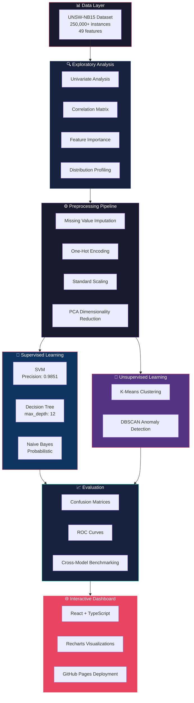
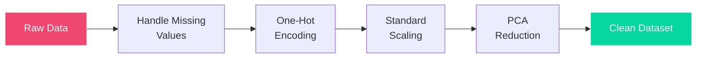

<div align="center">

<br/>

# 🛡️ SENTINEL.AI

### Advanced Network Intrusion Detection System

**Machine Learning–Powered Threat Classification on 250,000+ Network Traffic Instances**

<br/>

[](https://omarjebbari.github.io/Sentinel.ai---NIDS-Network-Intrusion-Analysis/)
[](#-supervised-classification)
[](#-unsupervised-clustering)
[](#-dataset)

<br/>

<a href="https://omarjebbari.github.io/Sentinel.ai---NIDS-Network-Intrusion-Analysis/">
  
</a>

<br/><br/>


</div>

---

## 📋 Table of Contents

- [Overview](#-overview)
- [Live Demo](#-live-interactive-report)
- [Key Results](#-key-results)
- [Architecture](#-project-architecture)
- [Dataset](#-dataset)
- [Methodology](#-methodology)
  - [Exploratory Data Analysis](#phase-1--exploratory-data-analysis)
  - [Data Preprocessing](#phase-2--data-preprocessing)
  - [Supervised Classification](#phase-3--supervised-classification)
  - [Unsupervised Clustering](#phase-4--unsupervised-clustering)
- [Model Comparison](#-model-comparison)
- [Tech Stack](#-tech-stack)
- [Project Structure](#-project-structure)
- [Getting Started](#-getting-started)
- [Team](#-team)
- [License](#-license)

---

## 🎯 Overview

**Sentinel.ai** is a comprehensive data mining project that builds and evaluates a **Network Intrusion Detection System (NIDS)** using the UNSW-NB15 dataset. The project follows the complete data science lifecycle — from raw data exploration to production-ready ML models — and includes an **interactive web dashboard** for visualizing results.

### What We Built

| Component | Description |
|:----------|:------------|
| 🔬 **Research Notebook** | 250K+ instance analysis with full EDA, feature engineering, and model training |
| 🤖 **3 Supervised Models** | SVM, Decision Tree, Naive Bayes — trained and hyperparameter-tuned |
| 🧩 **2 Unsupervised Models** | K-Means and DBSCAN for anomaly detection and cluster discovery |
| 🌐 **Interactive Dashboard** | React/TypeScript web report deployed on GitHub Pages |

### The Problem

Modern networks face increasingly sophisticated cyber threats. Traditional rule-based intrusion detection systems fail to adapt to new attack patterns. **Sentinel.ai** applies machine learning to automatically classify network traffic as normal or one of **9 distinct attack categories**, achieving up to **98.51% precision**.

---

## 🌐 Live Interactive Report

> **Experience the full analysis as an interactive web application:**
>
> ### 🔗 [**sentinel.ai — Live Dashboard →**](https://omarjebbari.github.io/Sentinel.ai---NIDS-Network-Intrusion-Analysis/)
>
> The dashboard includes all chapters, code snippets, visualizations, and results in a navigable interface styled like a professional research report.

---

## 🏆 Key Results

<table>
  <tr>
    <th>Model</th>
    <th>Best Metric</th>
    <th>Score</th>
    <th>Highlight</th>
  </tr>
  <tr>
    <td>🔴 <b>SVM</b></td>
    <td>Precision</td>
    <td><code>0.9851</code></td>
    <td>Highest attack identification precision</td>
  </tr>
  <tr>
    <td>🟢 <b>Decision Tree</b></td>
    <td>Interpretability</td>
    <td>max_depth=12</td>
    <td>GridSearchCV-tuned, human-readable rules</td>
  </tr>
  <tr>
    <td>🔵 <b>Naive Bayes</b></td>
    <td>Speed</td>
    <td>Fastest</td>
    <td>ROC curve analysis, probabilistic output</td>
  </tr>
  <tr>
    <td>🟣 <b>K-Means</b></td>
    <td>Clusters</td>
    <td>Optimal K</td>
    <td>Traffic pattern segmentation</td>
  </tr>
  <tr>
    <td>🟠 <b>DBSCAN</b></td>
    <td>Anomalies</td>
    <td>Noise detection</td>
    <td>Zero-day attack discovery potential</td>
  </tr>
</table>

---

## 🏗️ Project Architecture



---

## 📊 Dataset

### UNSW-NB15

The [UNSW-NB15 dataset](https://research.unsw.edu.au/projects/unsw-nb15-dataset) was created by the Australian Centre for Cyber Security (ACCS). It contains a hybrid of real modern normal activities and synthetic contemporary attack behaviors.

| Property | Value |
|:---------|:------|
| **Instances** | 250,000+ |
| **Features** | 49 (flow-based, content-based, time-based) |
| **Attack Categories** | 9 (Fuzzers, Analysis, Backdoors, DoS, Exploits, Generic, Reconnaissance, Shellcode, Worms) |
| **Normal Records** | ~87,000 |
| **Attack Records** | ~175,000 |

### Attack Category Distribution

```
Generic         ██████████████████████████████  40,000+
Exploits        ████████████████████            33,393
Fuzzers         ██████████████                  24,246
DoS             ████████                        16,353
Reconnaissance  ████████                        13,987
Analysis        ███                              2,677
Backdoors       ██                               2,329
Shellcode       ██                               1,511
Worms           ▎                                  174
```

---

## 🔬 Methodology

### Phase 1 — Exploratory Data Analysis

Deep statistical profiling of the dataset to understand feature distributions, correlations, and class imbalance:

- **Univariate Analysis** — Distribution of each feature across normal vs. attack traffic
- **Bivariate Correlation** — Heatmaps revealing feature interdependencies
- **Feature Importance** — Preliminary ranking of predictive features
- **Attack Category Profiling** — Statistical signatures of each attack type

### Phase 2 — Data Preprocessing



| Step | Technique | Purpose |
|:-----|:----------|:--------|
| Imputation | Mean/Mode filling | Handle missing values without data loss |
| Encoding | One-Hot Encoding | Convert categorical features (proto, state, service) |
| Scaling | StandardScaler | Normalize feature ranges for SVM and clustering |
| Dimensionality | PCA | Reduce feature space while preserving variance |

### Phase 3 — Supervised Classification

#### 🔴 Support Vector Machine (SVM)

- **Kernel:** RBF (Radial Basis Function)
- **Precision:** `0.9851` for attack detection
- **Strength:** Excellent on high-dimensional data, maximizes decision boundary margin
- **Use case:** When classification accuracy is critical

#### 🟢 Decision Tree

- **Hyperparameter Tuning:** GridSearchCV
- **Optimal max_depth:** 12
- **Strength:** Fully interpretable — produces human-readable decision rules
- **Use case:** When explainability is required (compliance, audits)

#### 🔵 Naive Bayes (Gaussian)

- **Approach:** Probabilistic classification using Bayes' theorem
- **Strength:** Extremely fast training and inference
- **Output:** ROC curves, probability distributions per class
- **Use case:** Real-time detection where speed > precision

### Phase 4 — Unsupervised Clustering

#### 🟣 K-Means

- Segments network traffic into K distinct behavioral clusters
- Elbow method used to determine optimal cluster count
- Reveals natural groupings in traffic patterns
- Useful for discovering unknown attack categories

#### 🟠 DBSCAN (Density-Based Spatial Clustering)

- Density-based approach that doesn't require pre-specifying K
- Automatically identifies noise points as potential anomalies
- **Key advantage:** Can detect zero-day attacks as outliers
- Effective on non-spherical cluster shapes common in network data

---

## 📊 Model Comparison

| Metric | SVM | Decision Tree | Naive Bayes |
|:-------|:---:|:-------------:|:-----------:|
| **Precision (Attack)** | ⭐ 0.9851 | High | Moderate |
| **Interpretability** | Low | ⭐ High | Moderate |
| **Training Speed** | Slow | Fast | ⭐ Fastest |
| **Handling High Dimensions** | ⭐ Excellent | Good | Good |
| **Real-time Capability** | Limited | ⭐ Good | ⭐ Excellent |

> **Recommendation:** SVM provides the best detection accuracy, while Decision Trees offer the best balance of performance and interpretability for deployment in production NIDS.

---

## 🛠️ Tech Stack

### Data Science & ML

| Tool | Purpose |
|:-----|:--------|
| **Python 3** | Core programming language |
| **Pandas / NumPy** | Data manipulation and numerical computing |
| **Scikit-Learn** | ML models, preprocessing, evaluation |
| **Matplotlib / Seaborn** | Statistical visualizations |
| **Jupyter Notebook** | Interactive research environment |

### Interactive Dashboard

| Tool | Purpose |
|:-----|:--------|
| **React 19** | Component-based UI framework |
| **TypeScript** | Type-safe frontend logic |
| **Vite 6** | Lightning-fast build tooling |
| **Recharts** | Data visualization components |
| **GitHub Pages** | Static site hosting & deployment |

---

## 📁 Project Structure

```
Sentinel.ai---NIDS-Network-Intrusion-Analysis/
│
├── 📓 real network traffic_Final_version2.ipynb   # Full Jupyter research notebook
│
├── 🌐 Interactive Dashboard (React/TypeScript)
│   ├── index.html                # Entry point
│   ├── index.tsx                 # React bootstrap
│   ├── App.tsx                   # Root application component
│   ├── constants.tsx             # Report structure & navigation
│   ├── types.ts                  # TypeScript interfaces
│   ├── vite.config.ts            # Vite build configuration
│   ├── tsconfig.json             # TypeScript configuration
│   └── package.json              # Dependencies & scripts
│
├── 📊 sections/                  # Report chapter components
│   ├── FrontMatter.tsx           # Title, Abstract, Acknowledgments
│   ├── Introduction.tsx          # Context & Motivation
│   ├── StateOfTheArt.tsx         # NIDS Foundations & Literature Review
│   ├── EDA.tsx                   # Exploratory Data Analysis
│   ├── Preprocessing.tsx         # Data Cleaning & Feature Engineering
│   ├── ClassificationSVM.tsx     # SVM Architecture & Results
│   ├── ClassificationDT.tsx      # Decision Tree Logic & Results
│   ├── ClassificationNB.tsx      # Naive Bayes Probability & Results
│   ├── ClusteringKMeans.tsx      # K-Means Discovery
│   ├── ClusteringDBSCAN.tsx      # DBSCAN Anomaly Isolation
│   ├── ClusteringComparison.tsx  # Comparative Clustering Analysis
│   ├── ModelComparison.tsx       # Cross-Model Benchmarking
│   ├── EvaluationResults.tsx     # Confusion Matrices & Metrics
│   └── Conclusion.tsx            # Final Conclusions & Future Work
│
├── 🧩 components/
│   └── CodeBlock.tsx             # Reusable code display component
│
├── .github/workflows/            # CI/CD pipeline for GitHub Pages
├── .gitignore
├── metadata.json
└── README.md
```

---

## 🚀 Getting Started

### Prerequisites

- **Node.js** 18+ and **npm** (for the dashboard)
- **Python** 3.8+ with Jupyter (for the notebook)
- **Git**

### Run the Interactive Dashboard Locally

```bash
# Clone the repository
git clone https://github.com/OmarJebbari/Sentinel.ai---NIDS-Network-Intrusion-Analysis.git
cd Sentinel.ai---NIDS-Network-Intrusion-Analysis

# Install dependencies
npm install

# Start the development server
npm run dev
```

The dashboard will be available at `http://localhost:5173`

### Run the Jupyter Notebook

```bash
# Install Python dependencies
pip install pandas numpy scikit-learn matplotlib seaborn jupyter

# Launch Jupyter
jupyter notebook "real network traffic_Final_version2.ipynb"
```

---

## 👥 Team

<table>
  <tr>
    <td align="center"><b>Jebbari Omar</b></td>
    <td align="center"><b>Oulad Dahman Zainab</b></td>
    <td align="center"><b>Ougrine Rokaya</b></td>
    <td align="center"><b>Ibnsalah Dirar</b></td>
  </tr>
</table>

**Program:** BDIA — ENSA Tétouan (ENSATe)

---

## 📝 License

This project is open source and available for academic and research purposes.

---

<div align="center">

<br/>

*"Innovation is the only path to digital immunity."*

<br/>

**⭐ Star this repo if you found it useful!**

<br/>

</div>
